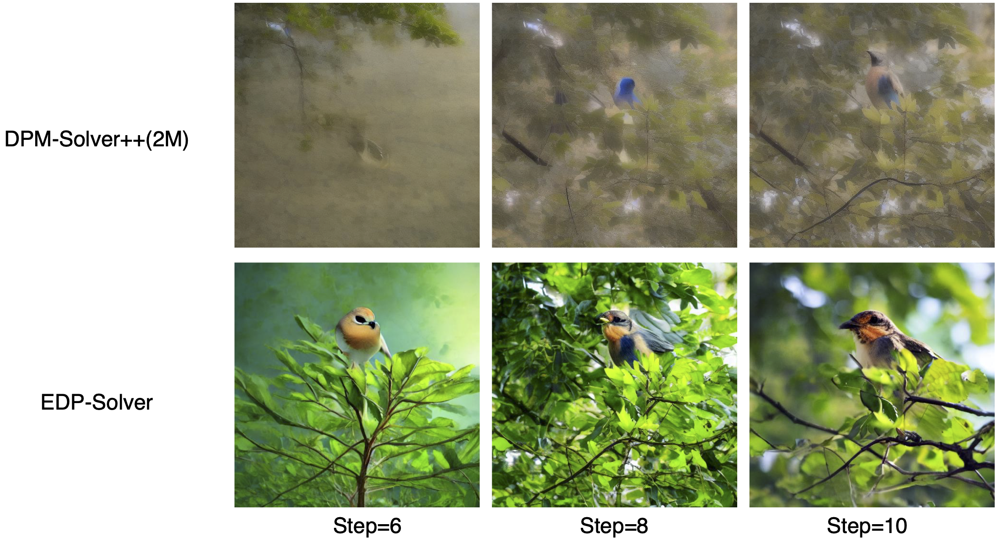
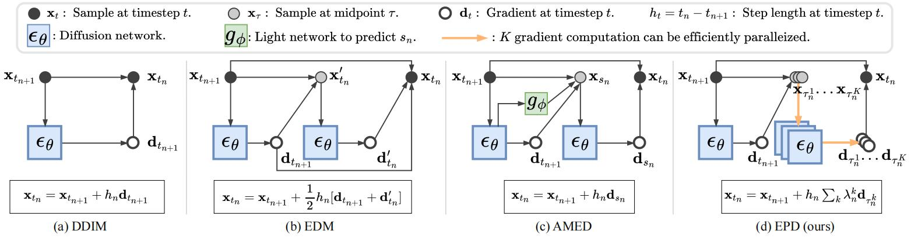

## [ICCV 2025] Distilling Parallel Gradients for Fast ODE Solvers of Diffusion Models<br><sub>Official implementation of the ICCV 2025 paper</sub>

<div align="center">

</div>

<div align="center">

<a href="https://arxiv.org/pdf/2507.14797" style="display: inline-block;">
    
</a>&nbsp;

</div>

**Abstract**: Diffusion models (DMs) have achieved state-of-the-art generative performance but suffer from high sampling latency due to their sequential denoising nature. Existing solver-based acceleration methods often face image quality degradation under a low-latency budget. In this paper, we propose the **E**nsemble **P**arallel **D**irection solver (dubbed as $\texttt{EPD-Solver}$), a novel ODE solver that mitigates truncation errors by incorporating multiple parallel gradient evaluations in each ODE step. Importantly, since the additional gradient computations are independent, they can be fully parallelized, preserving low-latency sampling. Our method optimizes a small set of learnable parameters in a distillation fashion, ensuring minimal training overhead. In addition, our method can serve as a plugin to improve existing ODE samplers. Extensive experiments on various image synthesis benchmarks demonstrate the effectiveness of our $\texttt{EPD-Solver}$ in achieving high-quality and low-latency sampling. For example, at the same latency level of 5 NFE, EPD achieves an FID of 4.47 on CIFAR-10, 7.97 on FFHQ, 8.17 on ImageNet, and 8.26 on LSUN Bedroom, surpassing existing learning-based solvers by a significant margin.



## Requirements
- This codebase mainly refers to the codebase of [EDM](https://github.com/NVlabs/edm). To install the required packages, please refer to the [EDM](https://github.com/NVlabs/edm) codebase.
- This codebase supports the pre-trained diffusion models from [EDM](https://github.com/NVlabs/edm), [ADM](https://github.com/openai/guided-diffusion), [Consistency models](https://github.com/openai/consistency_models), [LDM](https://github.com/CompVis/latent-diffusion) and [Stable Diffusion](https://github.com/CompVis/stable-diffusion). When you want to load the pre-trained diffusion models from these codebases, please refer to the corresponding codebases for package installation.

## Getting Started

## EPD Implementation Guide

- Run the commands in [launch.sh](./launch.sh) for training, sampling and evaluation using our recommended configurations. 
- All commands support multi-GPU parallelization by adjusting the `--nproc_per_node` parameter. 
- Complete parameter descriptions are available in the next section.

### Setup Notes:
- Required models will be automatically downloaded to `"./src/dataset_name"`
- Default configurations use 1 4090GPU for CIFAR10, FFHQ, ImageNet, and 4 A100 GPUs for LSUN Bedroom and Stable Diffusion
- Adjust batch size according to your hardware capabilities

**Important Note**:  
The `num_steps` parameter specifies the number of original timestamps. EPD inserts new timestamps between existing ones, so:
- When `num_steps=4`, the total becomes 7 timestamps (6 sampling steps)
- NFE = 5 if `afs==True`, otherwise 6

### Example Commands:

```bash
# EPD-Solver Configuration
SOLVER_FLAGS="--sampler_stu=epd --sampler_tea=heun --num_steps=4 --M=1 --afs=True --scale_dir=0.01 --scale_time=0"
SCHEDULE_FLAGS="--schedule_type=time_uniform --schedule_rho=1"
torchrun --standalone --nproc_per_node=4 --master_port=11111 \
train.py --dataset_name="cifar10" --batch=128 --total_kimg=10 $SOLVER_FLAGS $SCHEDULE_FLAGS
```

```.bash
# Generate 50K samples for FID evaluation
torchrun --standalone --nproc_per_node=1 --master_port=22222 \
sample.py --predictor_path=0 --batch=128 --seeds="0-49999"
```

The generated images will be stored at ```"./samples"``` by default. To compute Fréchet inception distance (FID) for a given model and sampler, compare the generated 50k images against the dataset reference statistics using ```fid.py```:

```.bash
# FID evaluation
python fid.py calc --images=path/to/images --ref=path/to/fid/stat
```


## Parameter Description

| Category          | Parameter          | Default | Description |
|-------------------|--------------------|---------|-------------|
| **General Options** | `dataset_name`     | None    | Supported datasets: `['cifar10', 'ffhq', 'afhqv2', 'imagenet64', 'lsun_bedroom', 'imagenet256', 'lsun_bedroom_ldm', 'ms_coco']` |
|                   | `predictor_path`   | None    | Path or experiment number of trained EPD predictor |
|                   | `batch`            | 64      | Total batch size |
|                   | `seeds`            | "0-63"  | Random seed range for image generation |
|                   | `grid`             | False   | Organize output images in grid layout |
|                   | `total_kimg`       | 10      | Training duration (in thousands of images) |
|                   | `scale_dir`        | 0.05    | Gradient direction scale (`c_n` in paper). Range: `[1-scale_dir, 1+scale_dir]` |
|                   | `scale_time`       | 0.05       | Input time scale (`a_n` in paper). Range: `[1-scale_time, 1+scale_time]` |
| **Solver Flags**  | `sampler_stu`      | 'epd'   | Student solver: `['epd', 'ipndm']` |
|                   | `sampler_tea`      | 'dpm'   | Teacher solver type |
|                   | `num_steps`        | 4       | Initial timestamps for student solver. Final steps = `2*(num_steps-1)` (EPD inserts intermediate steps) |
|                   | `M`                | 3       | Intermediate steps inserted between teacher solver steps |
|                   | `afs`              | False   | Enable Accelerated First Step (saves initial model evaluation) |
| **Schedule Flags**| `schedule_type`    | 'polynomial' | Time discretization: `['polynomial', 'logsnr', 'time_uniform', 'discrete']` |
|                   | `schedule_rho`     | 7       | Time step exponent (required for `polynomial`, `time_uniform`, `discrete`) |
| **Additional Flags** | `max_order`       | None    | Multi-step solver order: `1-4` for iPNDM, `1-3` for DPM-Solver++ |
|                   | `predict_x0`       | True    | DPM-Solver++: Use data prediction formulation |
|                   | `lower_order_final`| True    | DPM-Solver++: Reduce order at final sampling stages |
| **Guidance Flags** | `guidance_type`    | None    | Guidance method: `['cg' (classifier), 'cfg' (classifier-free), 'uncond' (unconditional), None]` |
|                   | `guidance_rate`    | None    | Guidance strength parameter |
|                   | `prompt`           | None    | Text prompt for Stable Diffusion sampling |

### Key Notes:
1. **EPD Step Calculation**: When `num_steps=N`, total steps = `2*(N-1)` (EPD inserts intermediate steps)
2. **Parameter Ranges**: 
   - `scale_dir`: Typically small values (0.01-0.1)
   - `scale_time`: 0 for no time scaling
3. **Multi-GPU Support**: All commands support `--nproc_per_node` for parallel execution

## 🚀 Performance Highlights


**Key Metric:** All results achieved at **5 NFE** (ultra-low latency)

| Dataset       | FID   | Improvement |
|---------------|-------|-------------|
| `CIFAR-10`    | 4.33  | +34% over SOTA |
| `FFHQ-64`     | 7.84  | +37% over SOTA | 
| `ImageNet-64` | 6.35  | +41% over SOTA |
| `LSUN Bedroom`| 7.52  | +43% over SOTA |


## Pre-trained EPD Predictors

We provide pre-trained EPD predictors for:

- CIFAR-10
- FFHQ64 
- ImageNet64
- LSUNBedroom

The pre-trained models are available in `./exp/`.

**Folder naming format:**
`<exp_num>-<dataset_name>-<num_steps>-<NFE>-<student>-<schedule>-<afs>`

**Usage:**

Run sampling with:

```bash
# Generate 50K samples for FID evaluation
torchrun --standalone --nproc_per_node=1 --master_port=22222 \
sample.py --predictor_path=EXP_NUM --batch=128 --seeds="0-49999"
```

## Pre-trained Diffusion Models
We perform sampling on a variaty of pre-trained diffusion models from different codebases including
[EDM](https://github.com/NVlabs/edm), [ADM](https://github.com/openai/guided-diffusion), [Consistency models](https://github.com/openai/consistency_models), [LDM](https://github.com/CompVis/latent-diffusion) and [Stable Diffusion](https://github.com/CompVis/stable-diffusion). The tested pre-trained models are listed below:

| Codebase | dataset_name | Resolusion | Pre-trained Models | Description |
|----------|---------|------------|--------------------|-------------|
|EDM|cifar10|32|[edm-cifar10-32x32-uncond-vp.pkl](https://nvlabs-fi-cdn.nvidia.com/edm/pretrained/edm-cifar10-32x32-uncond-vp.pkl)
|EDM|ffhq|64|[edm-ffhq-64x64-uncond-vp.pkl](https://nvlabs-fi-cdn.nvidia.com/edm/pretrained/edm-ffhq-64x64-uncond-vp.pkl)
|EDM|afhqv2|64|[edm-afhqv2-64x64-uncond-vp.pkl](https://nvlabs-fi-cdn.nvidia.com/edm/pretrained/edm-afhqv2-64x64-uncond-vp.pkl)
|EDM|imagenet64|64|[edm-imagenet-64x64-cond-adm.pkl](https://nvlabs-fi-cdn.nvidia.com/edm/pretrained/edm-imagenet-64x64-cond-adm.pkl)
|Consistency Models|lsun_bedroom|256|[edm_bedroom256_ema.pt](https://openaipublic.blob.core.windows.net/consistency/edm_bedroom256_ema.pt)|Pixel-space
|ADM|imagenet256|256|[256x256_diffusion.pt](https://openaipublic.blob.core.windows.net/diffusion/jul-2021/256x256_diffusion.pt) and [256x256_classifier.pt](https://openaipublic.blob.core.windows.net/diffusion/jul-2021/256x256_classifier.pt)|Classifier-guidance.
|LDM|lsun_bedroom_ldm|256|[lsun_bedrooms.zip](https://ommer-lab.com/files/latent-diffusion/lsun_bedrooms.zip)|Latent-space
|Stable Diffusion|ms_coco|512|[stable-diffusion-v1-5](https://huggingface.co/runwayml/stable-diffusion-v1-5/resolve/main/v1-5-pruned-emaonly.ckpt)|Classifier-free-guidance


## FID Statistics
For facilitating the FID evaluation of diffusion models, we provide our [FID statistics](https://drive.google.com/drive/folders/1f8qf5qtUewCdDrkExK_Tk5-qC-fNPKpL?usp=sharing) of various datasets. They are collected on the Internet or made by ourselves with the guidance of the [EDM](https://github.com/NVlabs/edm) codebase. 

You can compute the reference statistics for your own datasets as follows:

```
python fid.py ref --data=path/to/my-dataset.zip --dest=path/to/save/my-dataset.npz
```

## Citation
If you find this repository useful, please consider citing the following paper:

```
@ inproceedings{zhu2025distilling,
  title={Distilling Parallel Gradients for Fast ODE Solvers of Diffusion Models},
  author={Zhu, Beier and  Wang, Ruoyu and Zhao, Tong and Zhang, Hanwang and Zhang, Chi},
  booktitle={International Conference on Computer Vision (ICCV)},
  year={2025}
}
```
